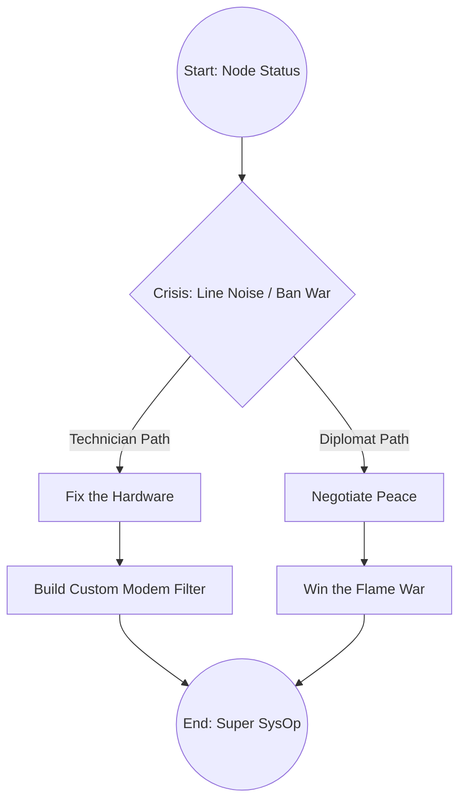

# Scenario Logic: Act 5 - The Crisis

```mermaid
flowchart TD
    Start((Start: Node Status)) --> Crisis{Crisis: Line Noise / Ban War}
    
    Crisis -->|Technician Path| TechArc[Fix the Hardware]
    Crisis -->|Diplomat Path| DiploArc[Negotiate Peace]
    
    TechArc --> TechSol[Build Custom Modem Filter]
    DiploArc --> DiploSol[Win the Flame War]
    
    TechSol --> End((End: Super SysOp))
    DiploSol --> End
```