# Логика сценария для районной карты (v1)

Этот файл является `source of truth` для ветвления сценария.  
На его основе собирается визуальная карта спального района в `draw.io`.

## 1. Область покрытия

- Основной путь: от первого запуска до финального "boss point".
- Покрытие по актам: Act 1-3 (текущий контент) + Act 4 (целевая финальная фаза).
- Дополнительно: 4 побочные арки из `docs/roadmap/scenarios.md`.

## 2. Каталог узлов (ID для синхронизации с картой района)

| ID | Тип | Что происходит | Объект на районной карте |
|---|---|---|---|
| N1 | Старт | Игрок начинает дома | Подъезд игрока |
| N2 | Основной | Инициализация модема (`ATZ`) | Квартира/окно дома |
| N3 | Основной | Первый дозвон до BBS | Телефонная будка/точка связи |
| N4 | Основной | Загрузка `T-Mail` и `GoldED` | Книжный киоск/ларек софта |
| N5 | Основной | Настройка `t-mail` и `golded` | АТС района |
| N6 | Основной | Poll + чтение правил + первый пост | Дворовой клуб/доска объявлений |
| B1 | Развилка | Стиль поведения в эхе | Перекресток между дворами |
| N7 | Основной | Конструктивный путь (репутация/союзы) | Штаб дворового актива |
| N8 | Основной | Конфликтный путь (флейм/давление) | Гаражный кооператив |
| N9 | Риск | Кризис сети и высокий риск потерь | Подстанция во время грозы |
| B2 | Развилка | Этический выбор перед финалом | Развилка у районного узла |
| F1 | Финал | "Легенда сети" / Super SysOp | Центральный узел связи |
| F2 | Финал | "Предатель" (sellout) | Офис провайдера/коммерческий выход |
| F3 | Финал | "Burnout" / технический крах | Пустой двор без связи |
| F4 | Финал | Secret ending ("Матрица") | Закрытый техподвал |

## 3. Побочные арки (опциональные)

| ID | Арка | Вход | Выход |
|---|---|---|---|
| S1 | Призрак в Эхе | после `N6` | в `N9` |
| S2 | Война Поинтов | после `N8` | в `N9` |
| S3 | Девушка в Сети | после `B1` | в `N7` или `N8` |
| S4 | Гроза | после `N4` или `N5` | в `N9` или `F3` |

## 4. Диаграмма логики (Mermaid)

```mermaid
flowchart LR
    N1((N1: Подъезд игрока))
    N2[N2: Инициализация модема]
    N3[N3: Первый дозвон]
    N4[N4: Скачать T-Mail/GoldED]
    N5[N5: Настройка станции]
    N6[N6: Poll + Rules + First Post]

    B1{B1: Стиль в эхе}
    N7[N7: Дипломат/союзы]
    N8[N8: Флейм/давление]

    S1([S1: Призрак в Эхе])
    S2([S2: Война Поинтов])
    S3([S3: Девушка в Сети])
    S4([S4: Гроза])

    N9{{N9: Кризис сети}}
    B2{B2: Выбор перед финалом}
    F1((F1: Легенда сети))
    F2((F2: Sellout))
    F3((F3: Burnout))
    F4((F4: Secret/Matrix))

    N1 --> N2 --> N3 --> N4 --> N5 --> N6 --> B1
    B1 -->|Конструктив| N7
    B1 -->|Конфликт| N8
    B1 -->|Личная линия| S3

    N7 --> N9
    N8 --> S2 --> N9
    N6 --> S1 --> N9
    N4 --> S4
    N5 --> S4
    S4 -->|Успел спасти железо| N9
    S4 -->|Провал| F3

    N9 --> B2
    B2 -->|Сеть важнее| F1
    B2 -->|Деньги важнее| F2
    B2 -->|Пасхалка| F4

    classDef main fill:#1D4ED8,color:#FFFFFF,stroke:#BFDBFE,stroke-width:1.5px;
    classDef split fill:#D97706,color:#111827,stroke:#FDE68A,stroke-width:2px;
    classDef side fill:#B0B7C3,color:#111827,stroke:#6B7280,stroke-width:1.2px;
    classDef risk fill:#B91C1C,color:#FFFFFF,stroke:#FCA5A5,stroke-width:2px;
    classDef fin fill:#14532D,color:#FFFFFF,stroke:#86EFAC,stroke-width:2.2px;
    classDef bad fill:#7F1D1D,color:#FFFFFF,stroke:#FCA5A5,stroke-width:2.2px;

    class N1,N2,N3,N4,N5,N6,N7,N8 main;
    class B1,B2 split;
    class S1,S2,S3,S4 side;
    class N9 risk;
    class F1,F4 fin;
    class F2,F3 bad;
```

## 5. Правила переноса в карту спального района (`draw.io`)

1. Каждый ID из таблицы размещается отдельным объектом на карте.
2. `N1 -> ... -> N9` идет как центральный маршрут через кварталы.
3. `S*` арки идут боковыми улицами/дворами и возвращаются в магистраль.
4. `B1` и `B2` рисуются как физические развилки дорог.
5. Финалы `F1..F4` размещаются на внешнем периметре района как конечные точки.

## 6. Что обновлять при изменении сценария

1. Сначала этот файл (`ID`, связи, условия переходов).
2. Затем `docs/roadmap/assets/district_game_map_v1.drawio`.
3. Затем экспорт `docs/roadmap/assets/district_game_map_v1.svg`.
