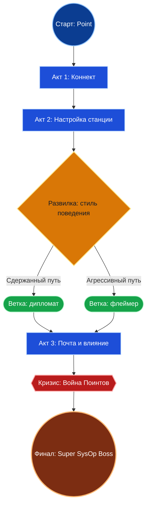
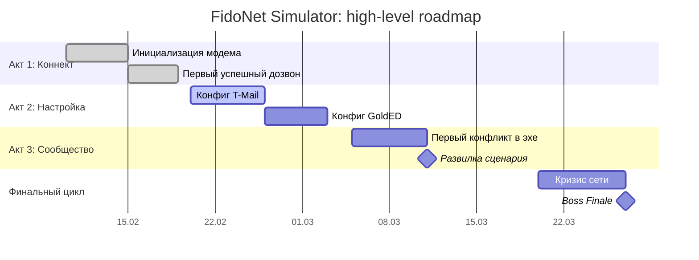
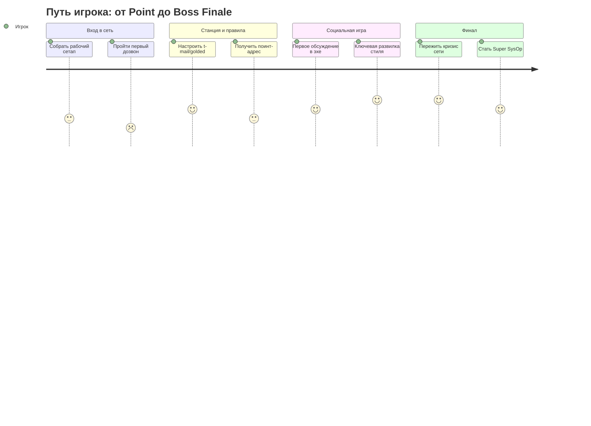

# Визуализация Roadmap и Сценарных Развилок (FidoNet Simulator)

## 1. Цель

Нужен единый способ визуализировать:
- путь игрока от стартовой точки до финала (условный "super boss");
- точки развилки сценария;
- параллельные сюжетные арки и их влияние на основной прогресс.

Документ фиксирует инструмент(ы), визуальный стиль и правила обновления схем.

---

## 2. Критерии выбора инструмента

1. Схема живет в репозитории рядом с кодом и документацией.
2. Изменения читаются через Git (diff/PR-review).
3. Поддерживаются ветвления, состояния, этапы и таймлайн.
4. Низкий порог входа для команды.
5. Можно быстро показать и в markdown-доке, и в презентационном виде.

---

## 3. Рекомендация по инструментам

## 3.1 Основной инструмент: Mermaid (как source of truth)

Почему:
- рендерится прямо в Markdown на GitHub;
- текстовый формат (удобно хранить и ревьюить в Git);
- есть нужные типы диаграмм: `flowchart`, `stateDiagram`, `journey`, `gantt`;
- поддерживается стилизация через `classDef` и `themeVariables`.

Когда использовать:
- roadmap по актам;
- карта развилок сценария;
- карта пути игрока.

## 3.2 Вспомогательный инструмент: draw.io (diagrams.net)

Почему:
- удобен для "постерного" или презентационного варианта схемы;
- можно хранить файлы в GitHub/GitLab и экспортировать SVG/PNG;
- подходит, когда нужно вручную выстроить сложную композицию.

Когда использовать:
- финальная иллюстрация для питча/дока;
- схема для обсуждений с не-технической аудиторией.

## 3.3 Опциональный инструмент для сюжетного прототипирования: Twine

Почему:
- заточен под нелинейные истории и ветвления;
- можно быстро прототипировать переходы между сценами без кода.

Когда использовать:
- быстрый нарративный прототип сложной ветвящейся арки.

---

## 4. Принцип работы (чтобы не было расхождения)

1. Источник истины: Mermaid-схемы в `docs/roadmap/`.
2. draw.io и любые картинки считаются производными артефактами.
3. Любая правка логики ветвления сначала обновляется в Mermaid.
4. После этого (при необходимости) обновляется презентационная схема.

---

## 5. Визуальный стиль карты игры

## 5.1 Семантика узлов

- `Старт` (круг): точка входа игрока.
- `Основной этап` (прямоугольник): обязательный шаг прогрессии.
- `Развилка` (ромб): место выбора пути.
- `Побочная арка` (скругленный прямоугольник): параллельный сюжет.
- `Риск/кризис` (шестиугольник или выделенный блок): точка повышенной ставки.
- `Финал` (двойной круг): концовка/босс-финал.

## 5.2 Цветовой код (ретро Fido/TUI)

- Основной путь: `#0B3D91` (Fido Blue).
- Технические шаги/система: `#1D4ED8`.
- Социальные/комьюнити-ветки: `#16A34A`.
- Развилка выбора: `#D97706`.
- Риск/провал: `#B91C1C`.
- Финал: `#7C2D12` с контрастным текстом.

## 5.3 Правила читаемости

1. Ось чтения всегда одна (`TD` или `LR`) и постоянна внутри схемы.
2. Основная ветка идет по центру, альтернативы по бокам.
3. Не более 3 исходящих ребер из одной развилки.
4. Каждое ребро подписано, если это выбор или условие.
5. В каждом узле максимум 2 строки текста.
6. Легенда классов и цветов обязательна для больших схем.

---

## 6. Набор обязательных схем

1. **Macro Roadmap**: акты и крупные milestone-этапы (`gantt` + краткий `flowchart`).
2. **Scenario Branch Map**: карта развилок и условий перехода (`flowchart` или `stateDiagram`).
3. **Player Journey Map**: путь игрока с ключевыми эмоциями/напряжением (`journey`).

---

## 7. Шаблоны (Mermaid)

## 7.1 Карта сценария с развилкой и финалом



## 7.2 Roadmap по актам



## 7.3 Путь игрока (journey)



---

## 8. Где хранить артефакты

Рекомендуемая структура:

```text
docs/
  roadmap/
    visualization_tooling_and_style.md
    maps/
      macro_roadmap.md
      scenario_branches.md
      player_journey.md
    assets/
      scenario_map_v1.drawio
      scenario_map_v1.svg
```

---

## 9. Краткий итог

1. Базовый инструмент: **Mermaid**.
2. Вспомогательный для презентаций: **draw.io**.
3. Для быстрого нарративного прототипа (опционально): **Twine**.
4. Главный принцип: логика ветвления сначала фиксируется в Mermaid, потом при необходимости оформляется в draw.io.

---

## 10. Источники

- GitHub Docs: Mermaid в Markdown  
  https://docs.github.com/en/get-started/writing-on-github/working-with-advanced-formatting/creating-diagrams
- Mermaid Flowchart  
  https://mermaid.js.org/syntax/flowchart.html
- Mermaid State Diagram  
  https://mermaid.js.org/syntax/stateDiagram.html
- Mermaid User Journey  
  https://mermaid.js.org/syntax/userJourney.html
- Mermaid Gantt  
  https://mermaid.js.org/syntax/gantt.html
- Mermaid Theme Configuration  
  https://mermaid.js.org/config/theming.html
- draw.io editor overview  
  https://www.drawio.com/doc/getting-started-editor
- draw.io integrations  
  https://www.drawio.com/integrations
- draw.io export formats  
  https://www.drawio.com/doc/faq/export-diagram
- Twine official site  
  https://ww.twinery.org/
