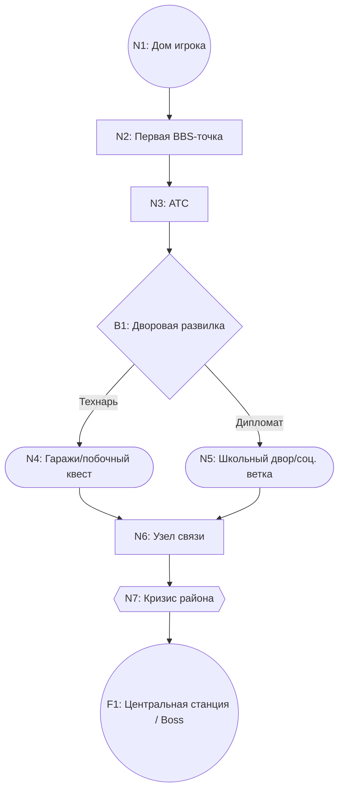

# Визуализация Roadmap и Сценарных Развилок (FidoNet Simulator)

## 1. Цель

Нужен единый способ визуализировать:
- путь игрока от стартовой точки до финала (условный "super boss");
- точки развилки сценария;
- параллельные сюжетные арки и их влияние на основной прогресс;
- карту прогрессии в виде **карты спального района с пятиэтажками**.

Документ фиксирует инструмент(ы), визуальный стиль и правила обновления схем.

---

## 2. Критерии выбора инструмента

1. Схема живет в репозитории рядом с кодом и документацией.
2. Изменения читаются через Git (diff/PR-review).
3. Поддерживаются ветвления, состояния, этапы и таймлайн.
4. Есть возможность сделать "дигетическую" карту района (улицы, дворы, пятиэтажки).
5. Можно быстро поддерживать и логическую схему, и визуальную карту.

---

## 3. Рекомендация по инструментам

### 3.1 Логический слой: Mermaid (source of truth)

Почему:
- рендерится прямо в Markdown на GitHub;
- текстовый формат (удобно хранить и ревьюить в Git);
- есть нужные типы диаграмм: `flowchart`, `stateDiagram`, `journey`, `gantt`.

Когда использовать:
- логика переходов;
- условия развилок;
- high-level roadmap по актам.

### 3.2 Визуальный слой карты района: draw.io (diagrams.net)

Почему:
- удобно собирать карту "как район" (дороги, кварталы, подъезды, дворы);
- можно использовать библиотеку фигур, иконки и собственные SVG-спрайты;
- легко экспортировать `svg/png` для документации.

Когда использовать:
- финальная карта сценария в стиле спального района;
- наглядная "карта игры" для справки внутри документации.

### 3.3 Опционально: Twine для раннего нарративного прототипа

Использовать только если нужно быстро прощупать ветвление текста до финальной карты.

---

## 4. Принцип работы (без расхождений)

1. Сначала обновляется логика в Mermaid (`docs/roadmap/maps/*.md`).
2. Каждый узел Mermaid получает ID (`N1`, `N2`, `B1` и т.д.).
3. Потом этот же набор узлов переносится в draw.io-карту района.
4. `draw.io` и `svg` считаются производными от Mermaid.

---

## 5. Визуальный стиль: "Спальный район 90-х"

### 5.1 Общая композиция

- Вид: top-down или легкая изометрия (без реалистичной перспективы).
- Основа: микрорайон из панельных пятиэтажек, дворов, гаражей, школы, АТС, киоска, остановки.
- Главный маршрут игрока: читаемый "сквозной" путь от дома до финальной точки.
- **UI Elements**:
    - **Winamp**: Реалистичный клон плеера с плейлистом (MIDI/tracker style music).
    - **StatusBar**: Минималистичный трей (время и день без лишних иконок фазы дня).

### 5.2 Семантика объектов (через объекты района)

- `Старт`: дом игрока, конкретный подъезд.
- `Основной этап`: отдельная пятиэтажка или важный объект района (АТС, узел связи, BBS-точка).
- `Развилка`: перекресток, развилка тропинок во дворе, переход между кварталами.
- `Побочная арка`: двор/гаражи/подвал/киоск (места опциональных событий).
- `Риск/кризис`: аварийная зона (темный двор, подстанция, гроза, "красная" территория).
- `Финал`: крупный объект (районный узел связи/центральная станция) как "boss point".

### 5.3 Цветовой код

- Фон района: `#E7E1D3` (выцветшая бумажная карта).
- Пятиэтажки: `#B0B7C3`.
- Дороги/проезды: `#6B7280`.
- Основной путь: `#1D4ED8`.
- Альтернативные ветки: `#D97706`.
- Риск/провал: `#B91C1C`.
- Финальная зона: `#14532D`.

### 5.4 Правила линий и маркеров

1. Главный маршрут: сплошная толстая линия.
2. Побочные маршруты: штриховая линия.
3. Заблокированные/опасные переходы: красная пунктирная линия.
4. Каждая развилка подписывается коротким условием выбора.

### 5.5 Подписи и стиль текста

- Шрифт: моноширинный (`PT Mono`, `IBM Plex Mono`, `Courier New`).
- Подписи короткие: до 2 строк в точке карты.
- Для узлов использовать ID + короткое имя, например: `N4: АТС`.

---

## 6. Обязательные артефакты

1. **Логика ветвления** (`Mermaid`): `scenario_logic.md`.
2. **Карта района** (`draw.io`): `district_game_map_v1.drawio`.
3. **Экспорт карты** (`SVG`): `district_game_map_v1.svg`.
4. **Путь игрока** (`Mermaid journey`): `player_journey.md`.

---

## 7. Шаблоны

### 7.1 Логическая карта ветвлений (Mermaid)



### 7.2 Таблица соответствия (Mermaid -> карта района)

```text
ID   | Тип узла      | Объект на карте района
N1   | Старт         | Подъезд дома игрока
N3   | Основной этап | АТС у трамвайной линии
B1   | Развилка      | Перекресток между дворами
N4   | Побочная арка | Гаражный кооператив
F1   | Финал         | Центральный узел связи
```

### 7.3 Чеклист готовности карты

1. На карте явно видны пятиэтажки и структура микрорайона.
2. Все узлы из Mermaid присутствуют и имеют те же ID.
3. Есть легенда линий (основной/побочный/опасный путь).
4. Старт и финал визуально выделены сильнее остальных точек.

---

## 8. Где хранить артефакты

```text
docs/
  roadmap/
    visualization_tooling_and_style.md
    maps/
      scenario_logic.md
      player_journey.md
    assets/
      district_game_map_v1.drawio
      district_game_map_v1.svg
```

---

## 9. Краткий итог

1. Логика: **Mermaid**.
2. Визуал "карта спального района с пятиэтажками": **draw.io**.
3. Порядок работы: сначала Mermaid, затем районная карта в draw.io.

---

## 10. Источники

- GitHub Docs: Mermaid в Markdown  
  https://docs.github.com/en/get-started/writing-on-github/working-with-advanced-formatting/creating-diagrams
- Mermaid Flowchart  
  https://mermaid.js.org/syntax/flowchart.html
- Mermaid User Journey  
  https://mermaid.js.org/syntax/userJourney.html
- Mermaid Gantt  
  https://mermaid.js.org/syntax/gantt.html
- draw.io editor overview  
  https://www.drawio.com/doc/getting-started-editor
- draw.io export formats  
  https://www.drawio.com/doc/faq/export-diagram
- Twine official site  
  https://twinery.org/
